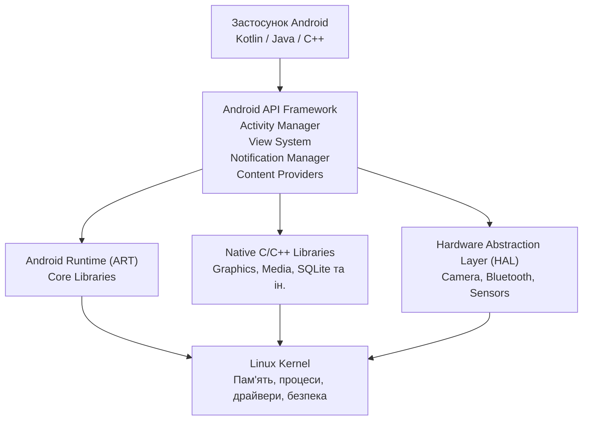
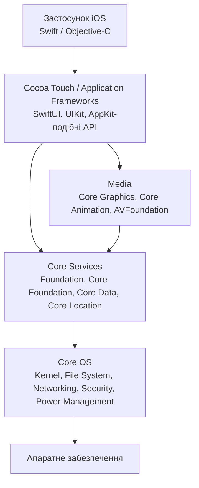

# Архітектурне порівняння Android та iOS

## 1. Мета роботи

Метою роботи є порівняння архітектур мобільних платформ **Android** та **iOS**, щоб новий розробник команди міг зрозуміти основні рівні операційних систем, їх призначення та відмінності у життєвому циклі екранів.
Android побудований як Linux-based програмний стек, у якому між застосунком і ядром розташовані Android Runtime, системні бібліотеки, HAL та API framework. ([Android Developers][1])
iOS використовує багаторівневу архітектуру, у якій вищі рівні спираються на системні служби та низькорівневі механізми. Традиційне архітектурне представлення iOS включає **Cocoa Touch, Media, Core Services та Core OS**. ([Apple Developer][2])

# 2. Архітектура Android

Основні компоненти Android можна представити як стек від апаратного рівня до застосунку.



### Основні рівні Android

| Рівень                     | Призначення                                      | Приклади                                                               |
| -------------------------- | ------------------------------------------------ | ---------------------------------------------------------------------- |
| **Застосунок**             | Код конкретного мобільного застосунку            | Kotlin, Java, C++, Jetpack                                             |
| **Android API Framework**  | Високорівневі API для створення застосунків      | Activity Manager, View System, Notification Manager, Content Providers |
| **Android Runtime (ART)**  | Виконання коду застосунків                       | DEX, JIT/AOT-компіляція, Garbage Collection                            |
| **Native C/C++ Libraries** | Низькорівневі системні можливості                | графіка, мультимедіа, SQLite                                           |
| **HAL**                    | Стандартизований доступ до апаратних можливостей | камера, Bluetooth, сенсори                                             |
| **Linux Kernel**           | Базовий рівень ОС                                | процеси, пам'ять, драйвери, безпека                                    |

Android Runtime (ART) відповідає за виконання застосунків, а Android використовує DEX-байткод та механізми JIT/AOT-компіляції. HAL надає стандартизовані інтерфейси для роботи з апаратними компонентами. Нижнім рівнем є Linux Kernel, який забезпечує базові механізми роботи з пам'яттю, потоками та апаратними драйверами. ([Android Developers][1])
Окремою особливістю Android є компонентна модель застосунків. Застосунок працює у власному Linux-процесі та ізольованому середовищі безпеки. ([Android Developers][3])

# 3. Архітектура iOS

Архітектуру iOS доцільно розглядати як стек системних рівнів, де кожен вищий рівень використовує можливості нижчих.



### Основні рівні iOS

| Рівень                                   | Призначення                                 | Приклади                                                    |
| ---------------------------------------- | ------------------------------------------- | ----------------------------------------------------------- |
| **Застосунок**                           | Логіка конкретного застосунку               | Swift, Objective-C                                          |
| **Cocoa Touch / Application Frameworks** | Побудова інтерфейсу та взаємодія з системою | SwiftUI, UIKit                                              |
| **Media**                                | Графіка, анімація, аудіо та відео           | Core Graphics, Core Animation, AVFoundation                 |
| **Core Services**                        | Фундаментальні системні сервіси             | Foundation, Core Foundation, Core Data, Core Location       |
| **Core OS**                              | Низькорівневі функції операційної системи   | ядро, файлова система, мережа, безпека, керування живленням |
| **Апаратне забезпечення**                | Фізичні компоненти пристрою                 | CPU, GPU, камера, сенсори                                   |

Apple описує Cocoa Touch як application-framework layer iOS. Нижче розташовуються Media та Core Services, а Core OS містить ядро, файлову систему, мережеву інфраструктуру, механізми безпеки, керування живленням та драйвери. ([Apple Developer][2])
У сучасній розробці важливими точками входу до UI є **SwiftUI** та **UIKit**. Для UIKit Apple використовує scene-based модель, у якій окремий `UIScene` представляє одну інстанцію інтерфейсу застосунку. ([Apple Developer][4])

# 4. Порівняння архітектур Android та iOS

| Критерій                 | Android                                                    | iOS                                                             |
| ------------------------ | ---------------------------------------------------------- | --------------------------------------------------------------- |
| Нижній системний рівень  | Linux Kernel                                               | Core OS                                                         |
| Доступ до апаратури      | HAL                                                        | Системні API та фреймворки                                      |
| Середовище виконання     | Android Runtime (ART)                                      | Системне середовище Apple                                       |
| Системні бібліотеки      | Native C/C++ Libraries                                     | Core Services / Media frameworks                                |
| Основний UI-рівень       | Android Framework / Jetpack                                | UIKit / SwiftUI                                                 |
| Основні мови             | Kotlin, Java, C++                                          | Swift, Objective-C                                              |
| Основна модель екрана    | Activity                                                   | Scene + View / ViewController                                   |
| Модель процесів          | Окремі процеси застосунків                                 | Застосунок працює у власному процесі, сцени можуть співіснувати |
| Робота з UI-станом       | Lifecycle Activity/Fragment + ViewModel та інші компоненти | Scene lifecycle + state management SwiftUI/UIKit                |
| Апаратна різноманітність | Висока                                                     | Значно більш контрольована Apple                                |

### Головна відповідність рівнів

| Android                  | iOS                           | Зміст                             |
| ------------------------ | ----------------------------- | --------------------------------- |
| Linux Kernel             | Core OS                       | Низькорівнева основа ОС           |
| HAL                      | Системні hardware API         | Абстракція доступу до апаратури   |
| Native Libraries         | Core Services / Media         | Системні бібліотеки та сервіси    |
| Android Framework        | Cocoa Touch / UIKit / SwiftUI | Високорівневі API для застосунків |
| Activity / UI Components | Scene / View / ViewController | Керування інтерфейсом             |

Важливо розуміти, що це **концептуальне зіставлення**, а не твердження про повну технічну еквівалентність компонентів.

# 5. Життєвий цикл екрана

## 5.1. Android

В Android життєвий цикл традиційного екрана значною мірою пов'язаний з об'єктом `Activity`.
Основні callback-и:

```text
onCreate()
    ↓
onStart()
    ↓
onResume()
    ↓
[Екран активний]
    ↓
onPause()
    ↓
onStop()
    ↓
onDestroy()
```

Android визначає шість основних callback-методів життєвого циклу: `onCreate`, `onStart`, `onResume`, `onPause`, `onStop` та `onDestroy`. ([Android Developers][5])
При цьому `onDestroy()` не слід розглядати як гарантоване місце для збереження всіх даних. Наприклад, Activity може бути знищена через зміну конфігурації, після чого буде створена нова Activity. Android рекомендує використовувати відповідні компоненти архітектури, зокрема `ViewModel`, для збереження стану UI. ([Android Developers][6])

## 5.2. iOS

У сучасному iOS життєвий цикл UI базується на **Scene**. Кожна сцена має власний життєвий цикл і `UISceneDelegate`. Одна програма може мати декілька сцен, особливо на iPad та інших пристроях, які підтримують багатовіконність. ([Apple Developer][7])
Спрощено:

```text
Unattached
    ↓
Foreground Inactive
    ↓
Foreground Active
    ↓
Background
    ↓
Suspended / Disconnected
```

UIKit повідомляє застосунок про зміни стану сцени, а `UISceneDelegate` використовується для реакції на відповідні події. ([Apple Developer][8])

# 6. Порівняння життєвих циклів

| Критерій                   | Android                     | iOS                                               |
| -------------------------- | --------------------------- | ------------------------------------------------- |
| Основний об'єкт UI         | Activity                    | Scene                                             |
| Початкове налаштування     | `onCreate()`                | підготовка Scene/UI                               |
| Активний стан              | `onResume()`                | `sceneDidBecomeActive`                            |
| Втрата активності          | `onPause()`                 | `sceneWillResignActive`                           |
| Перехід у фон              | `onStop()`                  | `sceneDidEnterBackground`                         |
| Знищення                   | `onDestroy()`               | Scene може бути від'єднана/знищена системою       |
| Багатовіконність           | Multi-window                | Scene-based multi-window                          |
| Основний ризик для новачка | Втрата стану при recreation | Зберігання стану на неправильному рівні Scene/App |

Головна відмінність полягає в тому, що Android традиційно прив'язує значну частину UI-життєвого циклу до **Activity**, тоді як сучасний iOS використовує **Scene** як окрему інстанцію інтерфейсу. Apple прямо зазначає, що з scene-based lifecycle події життєвого циклу відбуваються на рівні окремої сцени, а не глобально для всього застосунку. ([Apple Developer][9])

# 7. Що відбувається, якщо ігнорувати lifecycle

| Помилка                                     | Android                                                  | iOS                                                                  |
| ------------------------------------------- | -------------------------------------------------------- | -------------------------------------------------------------------- |
| Збереження стану лише в UI-об'єкті          | Дані можуть бути втрачені після recreation Activity      | Стан може бути втрачений при зміні стану Scene                       |
| Робота з ресурсами без урахування lifecycle | Витік пам'яті, зайва робота у фоні, непотрібні callbacks | Зайва фонова активність або некоректна поведінка при переходах Scene |
| Глобальне припущення про один екран/один UI | Проблеми з multi-window та configuration changes         | Некоректна робота при декількох Scene                                |

Наприклад, Android може знищити Activity через зміну конфігурації, а потім створити її заново. Якщо стан зберігався тільки у полях Activity, користувач може побачити скидання введених даних. ([Android Developers][6])
В iOS аналогічна проблема виникає, коли розробник припускає, що існує лише один глобальний UI. Scene-based lifecycle означає, що різні сцени можуть перебувати у різних станах одночасно. ([Apple Developer][7])

# 8. Три практичні наслідки для щоденної роботи розробника

### 1. По-різному потрібно зберігати стан

На Android не варто покладатися на те, що Activity залишиться в пам'яті назавжди. Стан UI потрібно відокремлювати від самої Activity, використовуючи відповідні архітектурні компоненти.
На iOS стан також не слід бездумно прив'язувати до конкретної Scene. Особливо це важливо для застосунків, які можуть мати декілька одночасних Scene.
**Практичний наслідок:** при проєктуванні нового екрана потрібно одразу визначити, де зберігається його стан і скільки часу він повинен існувати.

### 2. Фонові операції потрібно прив'язувати до lifecycle

Розробник не повинен виконувати постійні оновлення, анімації, прослуховування сенсорів або інші ресурсоємні операції, коли відповідний UI вже не використовується.
Android прямо рекомендує звільняти або змінювати ресурси, які не потрібні, коли Activity більше не видима. ([Android Developers][6])
В iOS розробник повинен враховувати переходи Scene між foreground та background. ([Apple Developer][7])
**Практичний наслідок:** мережеві запити, таймери, підписки та сенсори повинні мати чітко визначений момент запуску та зупинки.

### 3. Не можна переносити архітектурні рішення між платформами без адаптації

Activity Android та Scene iOS вирішують схожі задачі, але не є взаємозамінними компонентами.
Наприклад:

```text
Android                         iOS
-------                         ---
Activity       ───────────→    Scene
onResume()     ───────────→    sceneDidBecomeActive
onPause()      ───────────→    sceneWillResignActive
onStop()       ───────────→    sceneDidEnterBackground
ViewModel      ───────────→    State / Observable model
```

Це не означає, що кожен callback має абсолютний аналог. Це лише практична модель для орієнтації новачка.
**Практичний наслідок:** при розробці cross-platform продукту потрібно проектувати спільну бізнес-логіку окремо від платформного UI та lifecycle.

# 9. Підсумкове рішення

## Рекомендація: використовувати платформно-специфічний підхід до UI та lifecycle

Для команди, яка розробляє мобільні застосунки одночасно для Android та iOS, **рекомендується не намагатися уніфікувати життєвий цикл екрана**, а використовувати нативні механізми кожної платформи.

### Аргументи

1. **Lifecycle принципово відрізняється.** Android базується на Activity lifecycle, а сучасний iOS — на Scene lifecycle. ([Android Developers][5])

2. **Платформи по-різному керують UI та системними ресурсами.** Android використовує Activity та компоненти Android Framework, тоді як iOS використовує Scene, UIKit/SwiftUI та системні фреймворки. ([Android Developers][1])

3. **Нативний підхід спрощує використання можливостей ОС.** Розробник може правильно реагувати на зміни конфігурації Android або переходи Scene iOS без створення штучного спільного lifecycle.

### Визнаний ризик

**Основний ризик — збільшення обсягу платформного коду.** Якщо команда підтримує дві нативні реалізації, частина UI та lifecycle-логіки буде дублюватися. Проте цей ризик можна зменшити, винісши спільну бізнес-логіку, моделі даних і мережевий шар у незалежні від UI компоненти.

# 10. Висновок

Android та iOS мають схожу загальну ідею багаторівневої архітектури: прикладний рівень використовує високорівневі фреймворки, які спираються на системні сервіси та низькорівневі механізми операційної системи.
Основна практична відмінність для мобільного розробника полягає у життєвому циклі UI. В Android ключовим об'єктом традиційної моделі є `Activity`, а в сучасному iOS — `Scene`. Ігнорування цих моделей може призвести до втрати стану, некоректної роботи у фоні та проблем із багатовіконністю.
Тому для команди оптимальним рішенням є **спільна архітектура бізнес-логіки + платформно-специфічна реалізація UI та lifecycle**.

# 11. Джерела

> Дата звернення до всіх джерел: **10.09.2026**.

1. Google. **Platform architecture — Android Developers.**
   [Android Platform Architecture](https://developer.android.com/guide/platform?hl=ru)

2. Google. **The activity lifecycle — Android Developers.**
   [Android Activity Lifecycle](https://developer.android.com/guide/components/activities/activity-lifecycle?hl=ru)

3. Google. **Application fundamentals — Android Developers.**
   [Android Application Fundamentals](https://developer.android.com/guide/components/fundamentals?hl=ru)

4. Apple. **App and environment — Apple Developer Documentation.**
   [Apple App and Environment](https://developer.apple.com/documentation/uikit/app-and-environment)

5. Apple. **Managing your app's life cycle — Apple Developer Documentation.**
   [Apple App Lifecycle](https://developer.apple.com/documentation/uikit/managing-your-app-s-life-cycle)

6. Apple. **Scenes — Apple Developer Documentation.**
   [Apple UIKit Scenes](https://developer.apple.com/documentation/uikit/scenes)

7. Apple. **Transitioning to the UIKit scene-based life cycle.**
   [Apple Scene-based Lifecycle](https://developer.apple.com/documentation/uikit/transitioning-to-the-uikit-scene-based-life-cycle)

8. Apple. **What Is Cocoa? — Apple Developer Documentation Archive.**
   [Apple iOS Architecture / Cocoa Touch](https://developer.apple.com/library/archive/documentation/Cocoa/Conceptual/CocoaFundamentals/WhatIsCocoa/WhatIsCocoa.html)