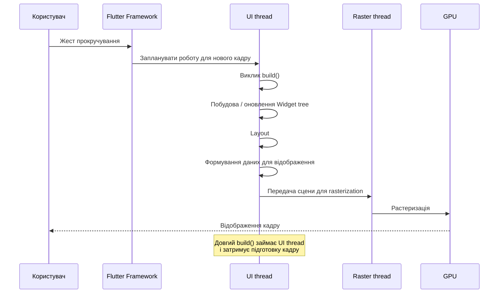
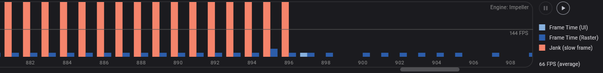
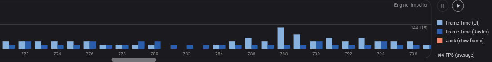

# Дослідження бюджету кадру у Flutter

## 1. Мета роботи

Метою роботи є дослідження того, що відбувається з продуктивністю Flutter-застосунку, коли виконання методу `build()` не вкладається у бюджет кадру.
Для проведення експерименту було створено мінімальний Flutter-застосунок зі списком елементів. У першому варіанті програми навмисно важке обчислення виконується безпосередньо всередині `build()`. Після цього обчислення переноситься за межі `build()`, а його результат зберігається та повторно використовується під час побудови інтерфейсу.
Для перевірки впливу такого підходу використовувався Flutter DevTools у режимі Profile.
Основними завданнями експерименту були:

- дослідити механізм формування кадру;
- показати, як важке обчислення всередині `build()` впливає на UI thread;
- виміряти продуктивність до оптимізації;
- перенести обчислення за межі `build()`;
- повторити вимірювання;
- порівняти отримані результати;
- пояснити, чому проблема особливо помітна під час прокручування.

## 2. Бюджет кадру у Flutter

Flutter повинен регулярно створювати та відображати нові кадри. Кожен кадр має обмежений проміжок часу, протягом якого необхідно виконати потрібну роботу.
Для дисплея з частотою оновлення 60 Hz доступний час між кадрами становить приблизно 16,7 мс. Для вищих частот оновлення цей час стає ще меншим.
Наприклад:

| Частота оновлення | Приблизний час на один кадр |
|---:|---:|
| 60 Hz | 16,7 мс |
| 66 Hz | 15,2 мс |
| 90 Hz | 11,1 мс |
| 120 Hz | 8,3 мс |
| 144 Hz | 6,9 мс |

Тому збільшення частоти оновлення дисплея одночасно підвищує вимоги до швидкості формування кадрів.
Якщо підготовка кадру займає більше часу, ніж доступно до моменту наступного оновлення дисплея, кадр може бути пропущений. Для користувача це проявляється як нерівномірна анімація, ривки або затримки під час прокручування. Таку проблему називають **jank**.
Flutter рекомендує виконувати профілювання продуктивності в **Profile mode**, оскільки результати Debug mode не є показовими для оцінки реальної продуктивності застосунку.
У цьому дослідженні для першого вимірювання використовувалася частота оновлення **66 Hz**, а для другого — **144 Hz**. Через це результати двох запусків не можна розглядати як повністю контрольований лабораторний тест, але вони дозволяють продемонструвати механізм впливу важкого `build()` на роботу UI.

Джерела:

- [Flutter Performance best practices](https://docs.flutter.dev/perf/best-practices)
- [Flutter performance profiling](https://docs.flutter.dev/perf/ui-performance)
- [Flutter DevTools Performance View](https://docs.flutter.dev/tools/devtools/performance)

## 3. Конвеєр формування кадру

Спрощено послідовність підготовки та відображення кадру у Flutter можна представити за допомогою діаграми:



У межах цього експерименту важливим є етап виконання `build()`.

`build()` відповідає за опис того, який UI повинен бути побудований на основі поточного стану. Якщо всередині цього методу виконується складне синхронне обчислення, воно також займає час UI thread.

Спрощено проблему можна представити так:

```text
Користувач прокручує список
        ↓
відбувається оновлення стану
        ↓
викликається build()
        ↓
виконується важке обчислення
        ↓
UI thread витрачає додатковий час
        ↓
підготовка кадру затримується
        ↓
кадр може не вкластися у доступний час
        ↓
jank
```

Важливо зазначити, що `build()` не є всім процесом рендерингу. Це лише одна з частин роботи, необхідної для підготовки інтерфейсу. Саме тому завдання `build()` полягає в тому, щоб якомога швидше описати необхідний UI та не виконувати в ньому зайву дорогу роботу.

## 4. Експеримент

Для експерименту було створено мінімальний Flutter-застосунок. На екрані відображається список із 100 елементів.
Принцип експерименту полягає у порівнянні двох варіантів:

### Варіант 1 — важке обчислення у `build()`

При кожному виклику `build()` запускається функція `heavyCalculation()`.

```text
build()
   ↓
heavyCalculation()
   ↓
5 000 000 ітерацій
   ↓
отримання результату
   ↓
побудова UI
```

### Варіант 2 — обчислення за межами `build()`

Обчислення виконується один раз у `initState()`, а результат зберігається у змінній.

```text
initState()
   ↓
heavyCalculation()
   ↓
cachedValue

build()
   ↓
використання cachedValue
```

Для того щоб проблема була добре помітною під час тестування, у програмі навмисно використовується обчислення з великою кількістю ітерацій.

### Код експерименту

```dart
import 'package:flutter/material.dart';

void main() => runApp(const MaterialApp(home: Demo()));

class Demo extends StatefulWidget {
  const Demo({super.key});

  @override
  State<Demo> createState() => _DemoState();
}

class _DemoState extends State<Demo> {
  final controller = ScrollController();
  bool heavyInBuild = true;
  late int cachedValue;

  @override
  void initState() {
    super.initState();
    cachedValue = heavyCalculation();
    controller.addListener(() => setState(() {}));
  }

  int heavyCalculation() {
    var result = 0;
    for (var i = 0; i < 5000000; i++) {
      result = (result + i * 31) % 1000003;
    }
    return result;
  }

  @override
  Widget build(BuildContext context) {
    final value = heavyInBuild ? heavyCalculation() : cachedValue;

    return Scaffold(
      appBar: AppBar(
        title: Text(heavyInBuild ? 'Важке build()' : 'Оптимізовано'),
        actions: [
          Switch(
            value: heavyInBuild,
            onChanged: (v) => setState(() => heavyInBuild = v),
          )
        ],
      ),
      body: ListView.builder(
        controller: controller,
        itemCount: 100,
        itemBuilder: (_, i) => ListTile(
          title: Text('Елемент $i'),
          subtitle: Text('Результат: $value'),
        ),
      ),
    );
  }
}
```

Ключовим елементом експерименту є рядок:

```dart
final value = heavyInBuild ? heavyCalculation() : cachedValue;
```

Коли `heavyInBuild` має значення `true`, кожен виклик `build()` запускає `heavyCalculation()`.
Сама функція містить цикл:

```dart
for (var i = 0; i < 5000000; i++) {
  result = (result + i * 31) % 1000003;
}
```

Це штучне обчислення не має практичного призначення. Воно використовується тільки для створення контрольованого навантаження під час експерименту.
Для того щоб `build()` повторно запускався під час прокручування, використовується:

```dart
controller.addListener(() => setState(() {}));
```

Таким чином, прокручування списку викликає оновлення стану, після чого Flutter виконує повторну побудову UI.

## 5. Чому це створює проблему

Метод `build()` може викликатися багато разів протягом роботи застосунку. Тому його не варто використовувати для дорогих операцій, які не потрібно виконувати при кожній перебудові.
У цьому експерименті важке обчислення не залежить від поточного положення списку або інших даних UI. Його результат залишається однаковим.
Проте в неоптимізованому варіанті воно запускається знову:

```text
build()
   ↓
heavyCalculation()
   ↓
5 000 000 операцій
```

Якщо `build()` викликається багато разів, одна й та сама операція виконується багато разів.
Таким чином, проблема полягає не тільки у складності обчислення. Додатковою проблемою є його **повторне виконання**.
Механізм можна описати так:

```text
setState()
   ↓
build()
   ↓
heavyCalculation()
   ↓
велика кількість синхронних операцій
   ↓
UI thread зайнятий
   ↓
інші операції кадру очікують
   ↓
збільшується час підготовки кадру
   ↓
можливий jank
```

Flutter зазначає, що дорогої повторюваної роботи у `build()` потрібно уникати, оскільки цей метод може викликатися часто.
У цьому випадку проблема спеціально посилюється під час прокручування, оскільки саме тоді інтерфейс активно оновлюється.

Джерела:

- [Flutter Performance best practices](https://docs.flutter.dev/perf/best-practices)
- [Flutter concurrency and isolates](https://docs.flutter.dev/perf/isolates)

## 6. Вимірювання до оптимізації

### Умови вимірювання

Перший запуск було виконано з неоптимізованою реалізацією, у якій `heavyCalculation()` запускається всередині `build()`.
Застосунок було запущено у Profile mode:

```bash
flutter run --profile
```

Для вимірювання використовувався Flutter DevTools → **Performance**.
Під час тесту список активно прокручувався вгору та вниз. Основна увага приділялася часу роботи UI thread та поведінці кадрів.
Параметри першого вимірювання:

| Показник | Значення |
|---|---:|
| Режим запуску | Profile |
| Пристрій | Windows |
| Частота оновлення | 66 Hz |
| Час між оновленнями кадру | приблизно 15,2 мс |
| Варіант програми | Важке `build()` |

За результатами вимірювання було отримано такі показники:

| Показник | До оптимізації |
|---|---:|
| Типовий UI frame time | 18,7 мс |
| Найгірший UI frame time | 27,9 мс |
| Кількість помітних janky frames | 14 |
| Поведінка під час scroll | Помітні ривки |

При частоті оновлення 66 Hz доступний інтервал для одного кадру становить приблизно 15,2 мс.
Отриманий типовий UI frame time 18,7 мс перевищує цей інтервал, а найгірший показник 27,9 мс перевищує його ще більше.
Це пояснює, чому під час активної прокрутки були помітні ривки.

### Скріншот вимірювання

Скріншот результату першого вимірювання збережено у:

```text
docs/before.png
```



На скріншоті показано результат роботи Performance View / Performance Overlay під час використання неоптимізованої версії програми.

## 7. Оптимізація

Після першого вимірювання було змінено спосіб виконання важкого обчислення.
У неоптимізованому варіанті обчислення виконується під час `build()`:

```dart
final value = heavyCalculation();
```

У результаті кожна перебудова UI може запускати 5 000 000 ітерацій.
Після оптимізації результат обчислюється один раз у `initState()`:

```dart
cachedValue = heavyCalculation();
```

Після цього `build()` використовує вже готове значення:

```dart
final value = cachedValue;
```

Отже, логіка змінилася:

```text
ДО ОПТИМІЗАЦІЇ

setState()
     ↓
build()
     ↓
heavyCalculation()
     ↓
5 000 000 ітерацій
     ↓
побудова UI


ПІСЛЯ ОПТИМІЗАЦІЇ

initState()
     ↓
heavyCalculation()
     ↓
cachedValue
     ↓
     ↓
setState()
     ↓
build()
     ↓
cachedValue
```

Після оптимізації під час повторного `build()` важке обчислення більше не запускається.
Це означає, що повторна перебудова інтерфейсу виконує менше зайвої роботи.
Для великих обчислень, які навіть після такого перенесення можуть надовго блокувати UI thread, Flutter також передбачає використання isolates. Вони дозволяють виконувати CPU-intensive роботу окремо від основного UI isolate.
У цьому експерименті використано простіше рішення, оскільки завдання полягає саме у демонстрації впливу важкого коду всередині `build()`.

Джерела:

- [Flutter Performance best practices](https://docs.flutter.dev/perf/best-practices)
- [Flutter concurrency and isolates](https://docs.flutter.dev/perf/isolates)

---

## 8. Вимірювання після оптимізації

Після зміни коду експеримент було повторено.
У новій версії `heavyCalculation()` виконується один раз у `initState()`, а під час подальших викликів `build()` використовується готове значення `cachedValue`.
Застосунок знову було запущено в Profile mode та протестовано під час прокручування списку.

### Умови другого вимірювання

| Показник | Значення |
|---|---:|
| Режим запуску | Profile |
| Пристрій | Windows |
| Частота оновлення | 144 Hz |
| Час між оновленнями кадру | приблизно 6,9 мс |
| Варіант програми | Оптимізовано |

За результатами другого вимірювання було отримано:

| Показник | До оптимізації | Після оптимізації |
|---|---:|---:|
| Типовий UI frame time | 18,7 мс | 3,6 мс |
| Найгірший UI frame time | 27,9 мс | 6,8 мс |
| Кількість помітних janky frames | 14 | 0 |
| Поведінка під час scroll | Помітні ривки | Плавне прокручування |

Після оптимізації типовий UI frame time становив 3,6 мс, а найгірший зафіксований показник — 6,8 мс.
Для дисплея з частотою 144 Hz інтервал між кадрами становить приблизно 6,9 мс. Отриманий найгірший показник 6,8 мс знаходиться приблизно в межах цього інтервалу.
У порівнянні з першим запуском кількість помітних janky frames зменшилася з 14 до 0.

### Скріншот після оптимізації

Результат другого вимірювання збережено у:

```text
docs/after.png
```



## 9. Чому проблема особливо помітна під час прокручування

Прокручування є хорошим сценарієм для демонстрації проблеми з важким `build()`, тому що під час нього UI постійно змінюється.
У цьому експерименті `ScrollController` має listener:

```dart
controller.addListener(() => setState(() {}));
```

Коли положення списку змінюється, викликається `setState()`.
Це призводить до повторної побудови віджета:

```text
Scroll
   ↓
ScrollController
   ↓
setState()
   ↓
build()
```

У неоптимізованому варіанті після цього запускається:

```text
build()
   ↓
heavyCalculation()
   ↓
5 000 000 ітерацій
```

Тобто під час прокручування дорога операція повторюється знову і знову.
Повний ланцюг виглядає так:

```text
Користувач прокручує список
          ↓
змінюється положення ScrollView
          ↓
викликається listener
          ↓
setState()
          ↓
build()
          ↓
heavyCalculation()
          ↓
UI thread зайнятий
          ↓
збільшується час підготовки кадру
          ↓
кадр може не встигнути
          ↓
jank
```

Після оптимізації:

```text
Користувач прокручує список
          ↓
змінюється положення ScrollView
          ↓
setState()
          ↓
build()
          ↓
використання cachedValue
          ↓
немає повторного важкого обчислення
          ↓
менше роботи на UI thread
          ↓
швидша підготовка кадру
```

Саме тому проблема може бути майже непомітною на статичному екрані.
Коли користувач нічого не робить, немає такого постійного потоку перебудов. Під час прокручування ж UI повинен регулярно реагувати на зміну положення списку.
Отже, навіть якщо важке обчислення виконується відносно швидко один раз, його багаторазове повторення під час scroll може призвести до перевищення доступного часу кадру.
Flutter рекомендує звертати особливу увагу на зайві rebuilds та дорогу роботу в `build()`, оскільки вони можуть погіршувати плавність інтерфейсу.

Джерела:

- [Flutter Performance best practices](https://docs.flutter.dev/perf/best-practices)
- [Flutter performance profiling](https://docs.flutter.dev/perf/ui-performance)
- [Flutter DevTools Performance View](https://docs.flutter.dev/tools/devtools/performance)

## 10. Практичне порівняння

Результати експерименту можна узагальнити в таблиці.

| Характеристика | До оптимізації | Після оптимізації |
|---|---|---|
| Місце виконання обчислення | `build()` | `initState()` |
| Повторне виконання обчислення | Так | Ні |
| Робота під час `build()` | Побудова UI + важке обчислення | Побудова UI + готове значення |
| Навантаження на UI thread | Вище | Нижче |
| Типовий UI frame time | 18,7 мс | 3,6 мс |
| Найгірший UI frame time | 27,9 мс | 6,8 мс |
| Janky frames | 14 | 0 |
| Частота оновлення під час тесту | 66 Hz | 144 Hz |
| Поведінка під час scroll | Помітні ривки | Плавніше прокручування |

З отриманих результатів видно, що перенесення обчислення за межі `build()` значно зменшило кількість зайвої роботи під час перебудови UI.
Водночас частота оновлення під час двох вимірювань була різною: 66 Hz до оптимізації та 144 Hz після оптимізації. Тому ці вимірювання не можна використовувати для точного визначення відсотка приросту продуктивності.
Натомість експеримент демонструє сам механізм: коли дороге обчислення виконується всередині `build()`, воно повторюється разом із rebuilds і може збільшувати час підготовки кадру.

## 11. Що показав експеримент

Експеримент показав, що проблема продуктивності може бути пов'язана не тільки зі складністю самого алгоритму, але й із тим, **де та як часто цей алгоритм запускається**.
В обох варіантах використовується одна й та сама функція:

```dart
heavyCalculation()
```

Її алгоритм не змінювався.
Змінилося лише місце виконання.

У першому варіанті:

```text
build()
   ↓
heavyCalculation()
```

У другому:

```text
initState()
   ↓
heavyCalculation()
   ↓
cachedValue
```

Таким чином, оптимізація не полягала у тому, щоб зробити сам цикл швидшим. Було змінено момент його виконання.
Це дозволило уникнути повторного запуску дорогої операції під час кожного rebuild.
Результати вимірювання показали:

- типовий UI frame time зменшився з **18,7 мс до 3,6 мс**;
- найгірший UI frame time зменшився з **27,9 мс до 6,8 мс**;
- кількість помітних janky frames зменшилася з **14 до 0**.

При цьому потрібно враховувати різну частоту оновлення під час двох вимірювань. Саме тому найбільш коректно використовувати ці результати для демонстрації механізму, а не для точного визначення універсального коефіцієнта прискорення.
Експеримент також показав, чому тестувати продуктивність потрібно в реальному сценарії використання. На статичному екрані проблема може бути неочевидною, але під час прокручування кількість rebuilds збільшується, тому вартість неправильного коду стає помітнішою.
Отже, важливо дивитися не тільки на те, наскільки складним є код, але й на те, **скільки разів він виконується протягом життєвого циклу UI**.

## 12. Висновок

У результаті роботи було досліджено, що відбувається, коли важке обчислення виконується всередині `build()` і через це збільшується час підготовки кадру.
Експеримент показав, що `build()` повинен залишатися максимально простим і не повинен містити важких повторюваних операцій, якщо їх результат можна підготувати заздалегідь.
У неоптимізованому варіанті обчислення виконувалося під час кожного `build()`. Через те, що під час прокручування список постійно оновлюється, це обчислення запускалося багато разів. У результаті збільшувався час роботи UI thread, а частина кадрів могла не вкладатися у доступний бюджет.
Після перенесення обчислення в `initState()` його результат зберігався у `cachedValue`. Під час наступних перебудов UI використовувався вже готовий результат. Це дозволило прибрати повторну дорогу операцію з `build()`.
За результатами вимірювання типовий UI frame time зменшився з 18,7 мс до 3,6 мс, а кількість помітних janky frames — з 14 до 0.
Однак під час експерименту використовувалися різні частоти оновлення дисплея: 66 Hz до оптимізації та 144 Hz після оптимізації. Тому отримані значення не слід сприймати як точне універсальне вимірювання приросту продуктивності. Вони демонструють вплив зміни структури коду на поведінку кадрів у конкретних умовах тестування.

### Що було зрозуміло додатково

Головний висновок, який я зрозумів у результаті експерименту і який не обмежується простим повторенням матеріалу лекції, полягає в тому, що **продуктивність залежить не тільки від того, наскільки важким є обчислення, але й від того, як часто воно повторюється**.
Одна й та сама операція може бути прийнятною, якщо виконати її один раз, але стати проблемою, якщо запускати її при кожній перебудові UI.
Тому під час оптимізації Flutter-застосунку потрібно аналізувати не тільки сам повільний код, а й причину, через яку цей код виконується повторно.
Практична послідовність пошуку проблеми виглядає так:

```text
Повільний кадр
     ↓
Аналіз Performance View
     ↓
Визначення проблемної ділянки
     ↓
Перевірка build / layout / paint / raster
     ↓
Пошук непотрібної повторної роботи
     ↓
Перенесення обчислення за межі build()
     ↓
Повторне вимірювання
     ↓
Якщо операція все одно блокує UI
     ↓
Розгляд використання isolate
```

Виходячи з цього, бюджет кадру потрібно сприймати як обмежений ресурс, який не можна витрачати на непотрібну роботу.

## 13. Джерела

> Дата звернення до всіх джерел: **14.09.2026**.

1. Flutter. **Performance best practices.**  
   https://docs.flutter.dev/perf/best-practices

2. Flutter. **Flutter performance profiling.**  
   https://docs.flutter.dev/perf/ui-performance

3. Flutter. **Use the Performance view.**  
   https://docs.flutter.dev/tools/devtools/performance

4. Flutter. **Performance metrics.**  
   https://docs.flutter.dev/perf/metrics

5. Flutter. **Concurrency and isolates.**  
   https://docs.flutter.dev/perf/isolates

6. Flutter. **Improving rendering performance.**  
   https://docs.flutter.dev/perf/rendering-performance