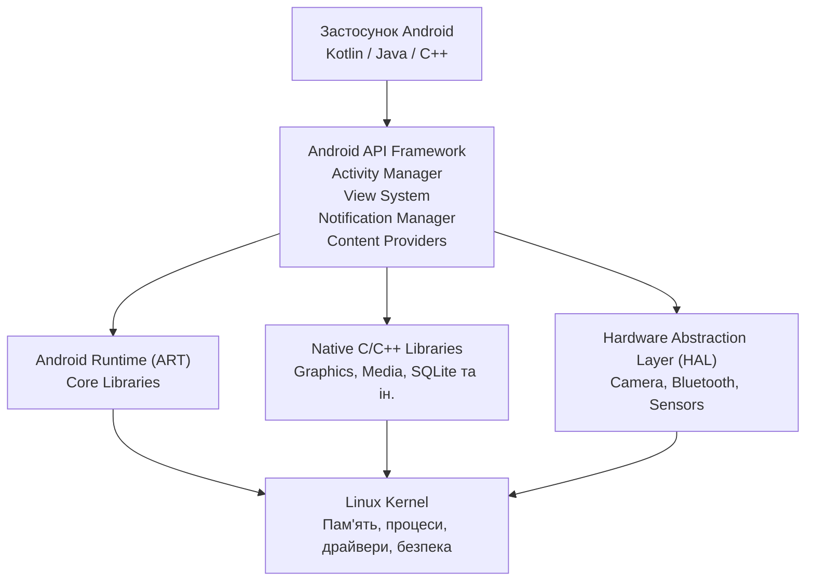
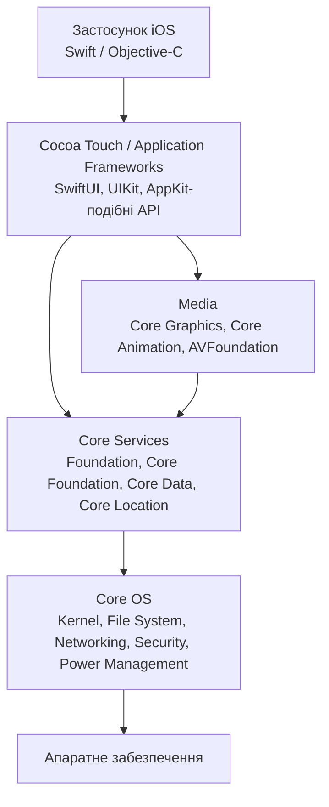

# Архітектурне порівняння Android та iOS

## 1. Мета роботи

Метою роботи є порівняння архітектур мобільних платформ **Android** та **iOS**, щоб новий розробник команди міг зрозуміти основні рівні операційних систем, їх призначення та відмінності у життєвому циклі екранів.

Android побудований як Linux-based програмний стек, у якому між застосунком і ядром розташовані Android Runtime, системні бібліотеки, HAL та API framework. ([Android Developers][1])

iOS використовує багаторівневу архітектуру, у якій вищі рівні спираються на системні служби та низькорівневі механізми. Традиційне архітектурне представлення iOS включає **Cocoa Touch, Media, Core Services та Core OS**. ([Apple Developer][2])

# 2. Архітектура Android

Основні компоненти Android можна представити як стек від апаратного рівня до застосунку.



### Основні рівні Android

| Рівень                     | Призначення                                      | Приклади                                                               |
| -------------------------- | ------------------------------------------------ | ---------------------------------------------------------------------- |
| **Застосунок**             | Код конкретного мобільного застосунку            | Kotlin, Java, C++, Jetpack                                             |
| **Android API Framework**  | Високорівневі API для створення застосунків      | Activity Manager, View System, Notification Manager, Content Providers |
| **Android Runtime (ART)**  | Виконання коду застосунків                       | DEX, JIT/AOT-компіляція, Garbage Collection                            |
| **Native C/C++ Libraries** | Низькорівневі системні можливості                | графіка, мультимедіа, SQLite                                           |
| **HAL**                    | Стандартизований доступ до апаратних можливостей | камера, Bluetooth, сенсори                                             |
| **Linux Kernel**           | Базовий рівень ОС                                | процеси, пам'ять, драйвери, безпека                                    |

Android Runtime (ART) відповідає за виконання застосунків, а Android використовує DEX-байткод та механізми JIT/AOT-компіляції. HAL надає стандартизовані інтерфейси для роботи з апаратними компонентами. Нижнім рівнем є Linux Kernel, який забезпечує базові механізми роботи з пам'яттю, потоками та апаратними драйверами. ([Android Developers][1])

Окремою особливістю Android є компонентна модель застосунків. Застосунок працює у власному Linux-процесі та ізольованому середовищі безпеки. ([Android Developers][3])

# 3. Архітектура iOS

Архітектуру iOS доцільно розглядати як стек системних рівнів, де кожен вищий рівень використовує можливості нижчих.



### Основні рівні iOS

| Рівень                                   | Призначення                                 | Приклади                                                    |
| ---------------------------------------- | ------------------------------------------- | ----------------------------------------------------------- |
| **Застосунок**                           | Логіка конкретного застосунку               | Swift, Objective-C                                          |
| **Cocoa Touch / Application Frameworks** | Побудова інтерфейсу та взаємодія з системою | SwiftUI, UIKit                                              |
| **Media**                                | Графіка, анімація, аудіо та відео           | Core Graphics, Core Animation, AVFoundation                 |
| **Core Services**                        | Фундаментальні системні сервіси             | Foundation, Core Foundation, Core Data, Core Location       |
| **Core OS**                              | Низькорівневі функції операційної системи   | ядро, файлова система, мережа, безпека, керування живленням |
| **Апаратне забезпечення**                | Фізичні компоненти пристрою                 | CPU, GPU, камера, сенсори                                   |

Apple описує Cocoa Touch як application-framework layer iOS. Нижче розташовуються Media та Core Services, а Core OS містить ядро, файлову систему, мережеву інфраструктуру, механізми безпеки, керування живленням та драйвери. ([Apple Developer][2])

У сучасній розробці важливими точками входу до UI є **SwiftUI** та **UIKit**. Для UIKit Apple використовує scene-based модель, у якій окремий `UIScene` представляє одну інстанцію інтерфейсу застосунку. ([Apple Developer][4])

# 4. Порівняння архітектур Android та iOS

| Критерій                 | Android                                                    | iOS                                                             |
| ------------------------ | ---------------------------------------------------------- | --------------------------------------------------------------- |
| Нижній системний рівень  | Linux Kernel                                               | Core OS                                                         |
| Доступ до апаратури      | HAL                                                        | Системні API та фреймворки                                      |
| Середовище виконання     | Android Runtime (ART)                                      | Системне середовище Apple                                       |
| Системні бібліотеки      | Native C/C++ Libraries                                     | Core Services / Media frameworks                                |
| Основний UI-рівень       | Android Framework / Jetpack                                | UIKit / SwiftUI                                                 |
| Основні мови             | Kotlin, Java, C++                                          | Swift, Objective-C                                              |
| Основна модель екрана    | Activity                                                   | Scene + View / ViewController                                   |
| Модель процесів          | Окремі процеси застосунків                                 | Застосунок працює у власному процесі, сцени можуть співіснувати |
| Робота з UI-станом       | Lifecycle Activity/Fragment + ViewModel та інші компоненти | Scene lifecycle + state management SwiftUI/UIKit                |
| Апаратна різноманітність | Висока                                                     | Значно більш контрольована Apple                                |

### Головна відповідність рівнів

| Android                  | iOS                           | Зміст                             |
| ------------------------ | ----------------------------- | --------------------------------- |
| Linux Kernel             | Core OS                       | Низькорівнева основа ОС           |
| HAL                      | Системні hardware API         | Абстракція доступу до апаратури   |
| Native Libraries         | Core Services / Media         | Системні бібліотеки та сервіси    |
| Android Framework        | Cocoa Touch / UIKit / SwiftUI | Високорівневі API для застосунків |
| Activity / UI Components | Scene / View / ViewController | Керування інтерфейсом             |

Важливо розуміти, що це **концептуальне зіставлення**, а не твердження про повну технічну еквівалентність компонентів.

# 5. Життєвий цикл екрана

## 5.1. Android

В Android життєвий цикл традиційного екрана значною мірою пов'язаний з об'єктом `Activity`.

Основні callback-и:

```text
onCreate()
    ↓
onStart()
    ↓
onResume()
    ↓
[Екран активний]
    ↓
onPause()
    ↓
onStop()
    ↓
onDestroy()
```

Android визначає шість основних callback-методів життєвого циклу: `onCreate`, `onStart`, `onResume`, `onPause`, `onStop` та `onDestroy`. ([Android Developers][5])

При цьому `onDestroy()` не слід розглядати як гарантоване місце для збереження всіх даних. Наприклад, Activity може бути знищена через зміну конфігурації, після чого буде створена нова Activity. Android рекомендує використовувати відповідні компоненти архітектури, зокрема `ViewModel`, для збереження стану UI. ([Android Developers][6])

## 5.2. iOS

У сучасному iOS життєвий цикл UI базується на **Scene**. Кожна сцена має власний життєвий цикл і `UISceneDelegate`. Одна програма може мати декілька сцен, особливо на iPad та інших пристроях, які підтримують багатовіконність. ([Apple Developer][7])

Спрощено:

```text
Unattached
    ↓
Foreground Inactive
    ↓
Foreground Active
    ↓
Background
    ↓
Suspended / Disconnected
```

UIKit повідомляє застосунок про зміни стану сцени, а `UISceneDelegate` використовується для реакції на відповідні події. ([Apple Developer][8])