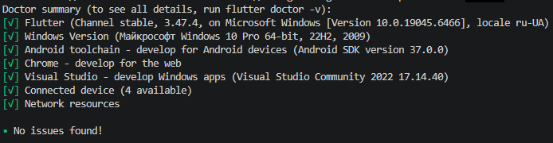
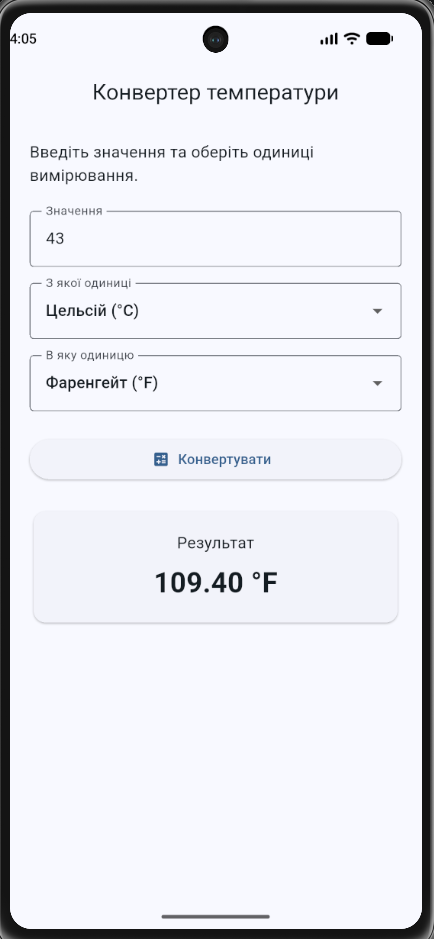

# Конвертер величин

## 1. Опис завдання

У межах практичної роботи було розроблено мобільний Flutter-додаток «Конвертер величин».
Для реалізації обрано конвертацію температури між трьома одиницями:
- Цельсій (°C);
- Фаренгейт (°F);
- Кельвін (K).
Додаток дозволяє користувачу ввести числове значення, вибрати початкову та кінцеву одиницю вимірювання і виконати конвертацію за допомогою кнопки.

## 2. Функціональні можливості

У застосунку реалізовано такі функції:
1. Введення числового значення температури.
2. Використання числової клавіатури на Android.
3. Вибір початкової одиниці вимірювання за допомогою Dropdown.
4. Вибір кінцевої одиниці вимірювання за допомогою Dropdown.
5. Виконання конвертації після натискання кнопки «Конвертувати».
6. Відображення результату конвертації.
7. Виведення результату з точністю до двох знаків після коми.
8. Перевірка порожнього поля введення.
9. Перевірка правильності введеного числового значення.
10. Перевірка температури нижче абсолютного нуля.
11. Підтримка введення десяткових значень як через крапку, так і через кому.

## 3. Структура проєкту

Проєкт має таку основну структуру:

```text
pr3/
├── lib/
│   ├── main.dart
│   ├── converter.dart
│   └── converter_page.dart
├── docs/
│   ├── flutter-doctor.png
│   └── emulator.png
├── android/
├── ios/
├── web/
├── windows/
├── pubspec.yaml
└── README.md
````

### Призначення основних файлів

**`main.dart`**
Містить точку входу в застосунок та головний віджет
`TemperatureConverterApp`. У цьому файлі налаштовується тема застосунку та відкривається сторінка конвертера.

**`converter.dart`**
Містить логіку конвертації температури. У файлі визначено перелік одиниць вимірювання, їх назви, клас `TemperatureConverter` та обробку некоректних значень.
Конвертаційна логіка винесена за межі віджетів відповідно до вимог завдання.

**`converter_page.dart`**
Містить користувацький інтерфейс застосунку:
* поле введення числового значення;
* два Dropdown для вибору одиниць;
* кнопку конвертації;
* відображення результату;
* повідомлення про помилки.

## 4. Реалізація конвертації

Для виконання конвертації використовується проміжне перетворення значення у градуси Цельсія.
Для перетворення з Фаренгейта у Цельсій використовується формула:
```text
°C = (°F - 32) × 5 / 9
```
Для перетворення з Цельсія у Фаренгейт:
```text
°F = °C × 9 / 5 + 32
```
Для перетворення з Цельсія у Кельвін:
```text
K = °C + 273.15
```
При перетворенні з Кельвіна у Цельсій:
```text
°C = K - 273.15
```
Використання проміжного значення у градусах Цельсія дозволяє виконувати конвертацію між усіма трьома одиницями без створення окремої формули для кожної можливої пари одиниць.

## 5. Обробка помилок

Перед виконанням конвертації програма перевіряє введене значення.
Якщо поле введення залишене порожнім, користувач отримує повідомлення:
```text
Введіть число для конвертації.
```
Якщо користувач вводить текст або інше некоректне значення, відображається повідомлення:
```text
Введіть коректне число, наприклад 25 або -12,5.
```
Також програма перевіряє температуру на відповідність фізичному обмеженню абсолютного нуля.
Якщо температура нижча за -273.15 °C, відображається повідомлення:
```text
Температура не може бути нижчою за абсолютний нуль.
```
Таким чином, некоректне введення не призводить до аварійного завершення застосунку, а користувач отримує зрозуміле повідомлення про проблему.

## 6. Робота з TextEditingController

Для отримання значення з текстового поля використовується `TextEditingController`.
Контролер створюється у стані сторінки:
```dart
final TextEditingController _inputController = TextEditingController();
```
Оскільки контролер займає ресурси, він звільняється у методі `dispose()`:
```dart
@override
void dispose() {
  _inputController.dispose();
  super.dispose();
}
```
Таким чином, у застосунку реалізовано правильне керування ресурсами `TextEditingController`.

## 7. Перевірка роботи

Роботу застосунку було перевірено на Android-емуляторі.

### Тест 1 — Цельсій → Фаренгейт

Вхідне значення:
```text
25 °C
```
Результат:
```text
77.00 °F
```

### Тест 2 — Цельсій → Кельвін

Вхідне значення:
```text
25 °C
```
Результат:
```text
298.15 K
```

### Тест 3 — Фаренгейт → Цельсій

Вхідне значення:
```text
77 °F
```
Результат:
```text
25.00 °C
```

### Тест 4 — некоректне введення

При введенні тексту замість числа програма не завершується з помилкою, а виводить повідомлення:
```text
Введіть коректне число, наприклад 25 або -12,5.
```

### Тест 5 — порожнє поле

Якщо натиснути кнопку «Конвертувати» без введення значення, програма виводить:
```text
Введіть число для конвертації.
```

### Тест 6 — температура нижче абсолютного нуля

При введенні значення, яке відповідає температурі нижче абсолютного нуля, програма не виконує некоректну конвертацію та виводить повідомлення:
```text
Температура не може бути нижчою за абсолютний нуль.
```

## 8. Hot Reload

Під час роботи застосунку було перевірено можливість використання Hot Reload.
Для перевірки було змінено текст заголовка застосунку під час його роботи та виконано Hot Reload.
Після виконання Hot Reload зміни одразу відобразилися у застосунку без повного перезапуску.
Поточний стан застосунку при цьому зберігся.
Hot Reload дозволяє швидко перевіряти зміни у коді та інтерфейсі під час розробки, не запускаючи застосунок повністю з початку.

## 9. Hot Restart

Також було перевірено роботу Hot Restart.
Під час тестування у поле було введено значення та виконано конвертацію. Після запуску Hot Restart застосунок повністю перезапустився.
Введене значення та отриманий результат були скинуті, оскільки стан застосунку було створено заново.
Таким чином:
* **Hot Reload** оновлює код застосунку зі збереженням поточного стану;
* **Hot Restart** повністю перезапускає застосунок та створює стан заново.

## 10. Перевірка flutter analyze

Під час перевірки застосунку було виявлено особливість середовища Windows.
Основний проєкт знаходиться за шляхом:
```text
C:\Users\Денис\OneDrive\Рабочий стол\Колледж\Programming for mobile\pr3
```
У цьому шляху присутні кириличні символи.
При виконанні команди:
```text
flutter analyze
```
у каталозі основного проєкту виникала помилка `FormatException` всередині analysis server.
При цьому команда:
```text
dart analyze
```
успішно виконувалася без помилок.
Для додаткової перевірки проєкт було скопійовано до каталогу без кириличних символів:
```text
D:\flutter_projects\pr3
```
У цій копії команда:
```text
flutter analyze
```
завершилася успішно:
```text
Analyzing pr3...
No issues found!
```
Це підтвердило, що помилок у Dart-коді немає, а проблема `flutter analyze` у початковому каталозі пов'язана з шляхом проєкту та роботою analysis server у Windows.

## 11. Скріншоти

### 11.1. Перевірка Flutter та Android SDK

На скріншоті показано результат виконання команди `flutter doctor`, яка використовується для перевірки налаштування Flutter та Android-інструментів.


### 11.2. Робота застосунку на Android-емуляторі

На скріншоті показано запущений застосунок «Конвертер величин» на Android-емуляторі.


## 12. Як запустити проєкт

Для запуску проєкту необхідно мати встановлені:
* Flutter SDK;
* Android Studio;
* Android SDK;
* Android Emulator.

### Перевірка Flutter

```bash
flutter doctor
```

### Перевірка доступних пристроїв

```bash
flutter devices
```

### Встановлення залежностей

```bash
flutter pub get
```

### Запуск застосунку

```bash
flutter run
```

### Запуск на конкретному пристрої

```bash
flutter run -d <device_id>
```

Перед запуском Android-версії необхідно запустити Android-емулятор або підключити фізичний Android-пристрій.

---

## 13. Використані технології

У роботі використано:
* **Flutter** — фреймворк для розробки мобільного застосунку;
* **Dart** — мова програмування;
* **Android Studio** — середовище для роботи з Android SDK та емулятором;
* **Android Emulator** — середовище для тестування мобільного застосунку;
* **Android SDK** — набір інструментів для розробки Android-застосунків;
* **Android NDK** — компонент Android SDK, необхідний для збірки проєкту;
* **Material Design** — компоненти та стилізація інтерфейсу Flutter.
Зовнішні бібліотеки та API для виконання конвертації не використовувалися.

## 14. Труднощі під час виконання

Під час виконання практичної роботи виникло декілька технічних проблем.
Спочатку Flutter не знаходив Android SDK. Проблему було вирішено шляхом вказання правильного шляху до Android SDK та встановлення необхідного компонента Android SDK Command-line Tools.
Під час першої збірки застосунку виникла проблема з відсутністю необхідної версії Android NDK. Потрібну версію `28.2.13676358` було встановлено через Android Studio, після чого застосунок успішно зібрався та запустився на Android-емуляторі.
Також було виявлено проблему з виконанням `flutter analyze` у початковому каталозі проєкту. Шлях до проєкту містить кириличні символи, через що analysis server завершував роботу з помилкою `FormatException`.
Для перевірки коду було створено копію проєкту у каталозі без кириличних символів:
```text
D:\flutter_projects\pr3
```
У цій копії:
```text
flutter analyze
```
успішно завершився з результатом:
```text
No issues found!
```
Таким чином було підтверджено відсутність помилок аналізу в реалізованому Dart-коді.

## 15. Висновок

У результаті виконання практичної роботи було розроблено мобільний Flutter-застосунок «Конвертер величин» для конвертації температури між градусами Цельсія, Фаренгейта та Кельвіна.
У застосунку реалізовано введення числового значення, вибір початкової та кінцевої одиниці вимірювання, виконання конвертації після натискання кнопки та відображення результату.
Також реалізовано обробку некоректного введення та перевірку температури на відповідність абсолютному нулю.
Конвертаційну логіку винесено в окремий клас `TemperatureConverter`, що відповідає вимозі щодо розділення логіки та інтерфейсу.
Для роботи з полем введення використовується `TextEditingController`, який правильно звільняється у методі `dispose()`.
Працездатність застосунку було перевірено на Android-емуляторі. Також було перевірено роботу механізмів Hot Reload та Hot Restart.
Під час виконання роботи було налаштовано Android SDK, Android Emulator та необхідну версію Android NDK. Додатково було перевірено код за допомогою `dart analyze` та `flutter analyze` у каталозі без кириличних символів, де було отримано результат `No issues found!`.